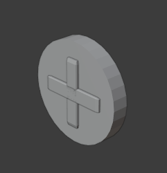

# Animated collectible

Creating a animated collectible is simple.

#### Create health coin

- Create new blender document
- Add a cylinder, and shape it to a coin.
- Add two 3D cubes and make them elongated into a cross.
- `Ctrl+J` to join the cross.
- Add bevel to it: `modifiers` in `right panel`, add `bevel`.

Add some color to both objects.

Save document.

#### Animation.

Open animation tab.

- Set the view to `front orthographic`
- Rewind the animation needle to zero/one
- Hover over the object, press `I`, then: Rotation.

> Keyframes will appear in the amination editor. Leave them as is.

Then:

- Move the blue needle to position 50.
- Press `N`
- Add: `90` in the `Z` `rotation` box.
- Hover over the object, press `I`, then: `Rotation`.

Repeat:

- Move the blue needle to position 100.
- Press `N`
- Add: `180` in the `Z` `rotation` box.
- Hover over the object, press `I`, then: `Rotation`.

#### Finish

Next, limit the animation duration to 150. In the bottom right of the animation editor, there is a small menu: `Start - End`

Set `End` to: `100`

Press Spacebar to see animation.

That is it.
