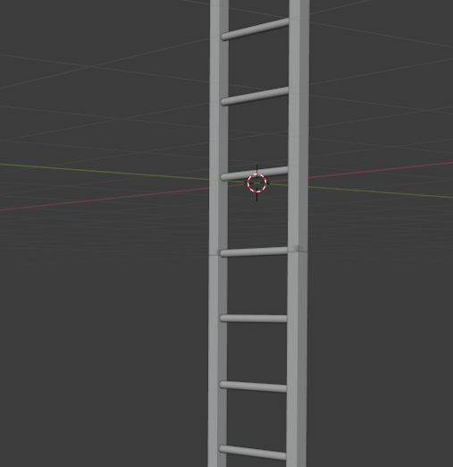

# Building a Simple Ladder in Blender

A quick tutorial for creating a basic ladder using two side rails and several rungs. 

#### Set Up the Scene

- Open Blender - you'll see the default cube.
- Select the cube and press `X` -> Delete (or right-click -> Delete) to clear the scene.
- Press `Numpad 1` for Front Orthographic view - easier to work in while building or select this from one of the top-right spheres.

#### Create the First Side Rail

- Add menu (top-left) -> Mesh -> Cube.
- Open the Item panel (`N` key) to see Transform properties.
- Set the cube's Scale: X = `0.05`, Y = `0.05`, Z = `1.5` - this makes it a tall thin rail.
- Set its Location: X = `-0.4`, Y = `0`, Z = `0`.

#### Create the Second Side Rail

- With the first rail selected, press `Shift + D` to duplicate it, then `Enter` to confirm the move (it'll be in the same spot).
- In the N-panel, change the duplicate's Location X to `0.4`.

You now have two parallel rails 0.8 units apart.

#### Create the First Rung

- Add -> Mesh -> Cylinder.
- In the Add Cylinder panel (bottom-left, click to expand) set Radius to `0.03` and Depth to `0.8`.
- With the cylinder selected, press `R`, then `Y`, then `90`, then `Enter` - this rotates it 90° around the Y axis so it lies horizontally connecting the two rails.
- Set Location: X = `0`, Y = `0`, Z = `-1.3` (near the bottom of the rails).

#### Duplicate the Rung Multiple Times

- With the rung selected, press `Shift + D`, then `Z`, type `0.3`, then `Enter` - this duplicates it and moves it up 0.3 units.
- Repeat this (`Shift + D`, `Z`, `0.3`, `Enter`) several more times until rungs fill the ladder from bottom to top (e.g., 8–9 rungs total for a 1.5-unit-tall rail).

> Tip: Instead of manually repeating, after your first duplicate-and-move, press `Shift + R` to repeat the last action - much faster for evenly spaced rungs.

#### Join Everything Into One Object

In `object mode`:

- Select all ladder pieces: press `A` (select all) or box-select with the mouse.
- Press `Ctrl + J` to join them into a single object.

#### Clean Up

- With the joined object selected, go to Object menu (top) -> Apply -> All Transforms - this resets scale/rotation values to a clean 1/0 baseline.
- Rename the object in the Outliner (top-right panel) by double-clicking its name -> type "Ladder".

#### Smooth/Bevel for Realism

- Select the ladder -> right-click -> Shade Smooth for a less blocky look on the cylinders.
- Add a Bevel modifier (Properties panel -> wrench icon -> Add Modifier -> Bevel) with a small amount like `0.01` to soften hard edges on the rails.

---

That's a basic ladder! From here you could add a Solidify modifier for thickness variation, add materials/colors via the Material Properties tab, or use an Array modifier on a single rung instead of manually duplicating.
