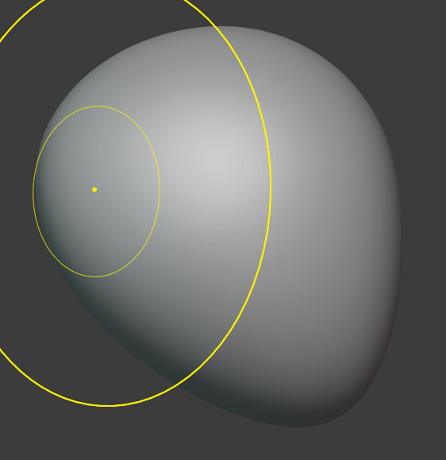

# Sculpting a Simple Stylized Skull in Blender

> Note: Before committing to this, we recommend the Blender Donut Tutorial, first.

This uses digital sculpting rather than box modeling - better suited to organic shapes. We'll keep it stylized/low-detail rather than anatomically precise, which is much more approachable for a first attempt. Works in Blender 3.x/4.x.

#### Set Up the Base Shape

1. `Add` -> `Mesh` -> `UV Sphere`.
2. In the `Add UV Sphere` panel (bottom-left), increase `Segments` and `Rings` to around `64` each - more geometry gives sculpt brushes more to work with.
3. Switch to the `Sculpting` workspace tab at the top of the screen.

#### Add Resolution for Sculpting

Since the sphere is still low-poly, you need a way to add detail as you sculpt.

- In the right menu, you'll see a Dyntopo button/toggle there directly - click it to switch it on
- Click the small dropdown arrow right next to that Dyntopo button to expand its settings
- Set `Detail Size` to around `8 px` - this controls how fine the added geometry is. Lower = more detail, slower performance.
- Above it, in `symmetry`, tick `X` to off otherwise Blender creates symetric scultping. Only use it for like eyes.

`Alternative:` instead of Dyntopo, add a `Multiresolution modifier` (Properties panel -> wrench icon -> Add Modifier -> Multiresolution) and click `Subdivide` 3–4 times. This gives more control but is a bit more setup - Dyntopo is simpler for a first attempt.

#### Block Out the Cranium

1. Select the `Grab` brush from the left menu. `Set radius to: 250`
2. Click and drag on the top-back of the sphere to pull it slightly, elongating the rounded cranium shape - skulls aren't perfectly spherical, they're a bit longer back-to-front.
3. Use `Grab` again on the lower-front area to start pulling out where the `jaw` will be - drag downward and slightly forward.
4. In viewpoint (large round coordinate gizmo on the top right) Switch to `Front Orthographic` to adjust the jaw and center it.

Don't worry about precision here - you're roughing out the big masses only.

The sphere should now look like this:

#### Build Up the Brow Ridge and Cheekbones

- In viewpoint, witch to `Front Orthographic` view, to draw the eyes/ridges. - Do not drag around as you might create asymmetries.
- In `symmetry`, tick `X` to `on` otherwise Blender does NOT create symmetric sculpting.
 
1. Switch to the `Clay Strips` brush (found in the toolbar, or press `C`).
2. Increase `Radius: 66` and lower `Strength: 0.3` in the top toolbar, for controlled build-up.
3. Paint two horizontal ridges above where the eyes will go - this is the brow ridge.
4. Paint two smaller raised areas on the sides, roughly level with the middle of the face - these become the cheekbones (zygomatic arches).

#### Carve the Eye Sockets

This is the trickiest part - two options:

`Option A - Sculpt them directly:`

1. Switch to the `Crease` brush.
2. Set `Strength` low (~`0.2`) and carefully press in two oval-ish indentations below the brow ridge, spaced evenly from the center.
3. Switch to `Smooth` brush and soften the harsh edges around each socket.

`Option B - Boolean cutout (more precise, recommended for beginners):`

1. Exit Sculpt Mode (`Tab` or switch back to Layout workspace).
2. `Add` -> `Mesh` -> `UV Sphere`, scale it down small (`S`, then type `0.15`, `Enter`), and position it where one eye socket should go.
3. Select the skull mesh -> Properties panel -> wrench icon -> `Add Modifier` -> `Boolean`.
4. Set `Operation` to `Difference`, and set `Object` to the small sphere you just placed.
5. Click the dropdown arrow next to the modifier -> `Apply`.
6. Delete the small sphere (it's done its job).
7. Repeat for the second eye socket (or duplicate the first sphere with `Shift+D` and mirror its X position before applying the boolean).

#### Carve the Nasal Cavity

1. Back in `Sculpt Mode`, use the `Crease` or `Draw Sharp` brush.
2. Carve a small inverted-triangle shape below and between the eye sockets.
3. Use `Smooth` to blend the edges so it doesn't look like a harsh cut.

#### Shape the Jaw

1. Use `Grab` to pull the lower portion of the sphere downward and slightly forward, forming the mandible.
2. Use `Clay Strips` to add a bit of width/mass at the back corners of the jaw (the jaw angle).
3. Optionally, use the `Crease` brush to suggest a tooth line - a shallow horizontal groove where the mouth would be. For a stylized skull, you don't need individual teeth.

#### Smooth and Refine

1. Switch to the `Smooth` brush and go over the entire model lightly - this blends your rougher brush strokes into a more cohesive surface.
2. Zoom in on any areas that look lumpy or uneven and touch up with `Clay Strips` (add) or `Scrape` (flatten/remove) as needed.

#### Clean Up for Export or Further Use

Sculpting with Dyntopo creates messy, dense, uneven geometry - fine for a display model, but not ideal for games or animation.

1. Add a `Remesh modifier` (Properties -> wrench icon -> Add Modifier -> Remesh) with `Mode` set to `Voxel`.
2. Adjust `Voxel Size` smaller for more detail retention, then click `Apply` - this gives you a cleaner, more uniform mesh topology while keeping your sculpted shape.
3. Optionally follow up with `Object -> Convert -> Mesh` if it's not already a plain mesh, and add a `Decimate modifier` if the poly count is too high for your target use (e.g., a game engine).

#### Shade and Finalize

1. Right-click -> `Shade Smooth` for a less faceted look.
2. Add a material as usual (this is where your `Material Baker` script comes in handy again - sculpted detail can be baked into a normal map on a clean retopologized copy, same principle as baking color).

---

That's a basic stylized skull! It won't be anatomically perfect, but it captures the key landmarks (cranium, brow, cheekbones, eye sockets, nasal cavity, jaw) using sculpting fundamentals you can apply to any organic shape - animals, character heads, creatures, etc.
