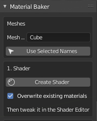
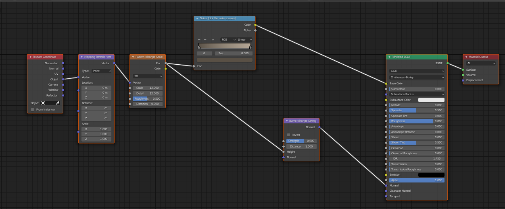
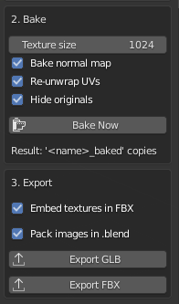

# Tree Creation in Blender

It is somewhat better to create your own trees in Blender, then to buy "all of them". Just buy a single set, perhaps 1-5 3D trees, and generate the rest yourself.

**My process:**

Buy one "Hero Tree", which is a paid tree which looks gorgeous. Behind it, place the blender generated trees. This creates a nice contrast, as the eye will land on the "Hero Tree" and assumes all the other trees are just as gorgeous. This is good for filling in large areas. The reason for this: store bought render trees are often huge in filesize: 100MB-300MB, which is too large for a game, which expects 1-5MB per tree.

# Sapling Tree Gen

Sapling Tree Gen is an add-on, so it may need to be switched on first.

### Enable the Sapling Tree Gen add-on

- `<= Blender 4.1: Edit > Preferences > Add-ons, search "Sapling" and tick the box.`
- `>= Blender 4.2: Edit > Preferences > Get Extensions, search "Sapling Tree Gen" and install it.`

### Create the tree

1. Hover your mouse over the 3D viewport and press **Shift+A**.
2. Choose Curve > Sapling Tree Gen (in some versions the entry is called "Add Tree").
3. A basic tree appears. 
4. Open the panel **"> Sapling: Add Tree"** or **"Adjust Last Operation"** panel at the bottom-lower-left of the viewport. 

> This is a small rectangular box at the lower left in the viewport. The panel only stays editable until you do something else, so tweak the tree straight away.

### Customize the tree

| Tab | What it does |
| --- | --- |
| Presets | Load ready-made trees (willow, palm, black tupelo...) and adjust from there |
| Geometry | Bevel (trunk thickness and smoothness), branch levels, scale |
| Branch Growth | How the branches spread out and curve |
| Branch Splitting | How often branches fork |
| Leaves | Tick Show Leaves, then set leaf count and shape (off by default) |

Change the seed value to get a different variation of the same tree.

### Add materials

The trunk and the leaves are separate objects, so each needs its own material.

For automated process, import: `/Blender/Material_Bakery.py` into blender add-ons. 
It will wire everything  correctly, bake the material and export it for you.

**In the Material Bakery:**

- Add mesh name which you want to shade and bake.
- Click create shader.
  
Then open the "Shading tab", and adjust these to your liking:

Make the effect visible

Raise Bump: Strength to around 0.5-1.

- On the Noise Texture, set Scale to around 20-50 and Detail to around 10, so the pattern looks like bark instead of big soft blobs.
- On the ColorRamp, set the left color to dark brown and the right color to a lighter brown.
- Rotate the view, because bump shows best when light hits at an angle.

After, go back to modeling, press N, in the Baker: click "Bake Now"

### Export

Click export to FBX or GLB

---

### Make a forest (scattering many trees)

**Quick method: duplicate**

- Select the tree and press Shift+D, then move it. Use Alt+D for linked duplicates that share the same mesh data.
- To vary the trees, generate a few with different seeds.

**Better method: Geometry Nodes**

1. Add a plane or your landscape mesh and open the Geometry Nodes workspace.
2. Add a "Distribute Points on Faces" node (Poisson Disk mode avoids overlapping trees).
3. Add an "Instance on Points" node and plug in your tree, either as an object via Object Info or as a collection.
4. Use the Instance on Points node's Rotation and Scale inputs, fed by Random Value nodes, to vary the trees.

**Tips**

- Lower the Sapling bevel resolution to keep the polygon count down when you have many trees.
- Convert a tree to a mesh with Object > Convert > Mesh if you need to edit it further.
- If an imported tree has a lot of vertexes, then use: Inspector > Modifier > Decimate to lower the vertexes.
- Keep a tree for a computer game small: 1-5MB
