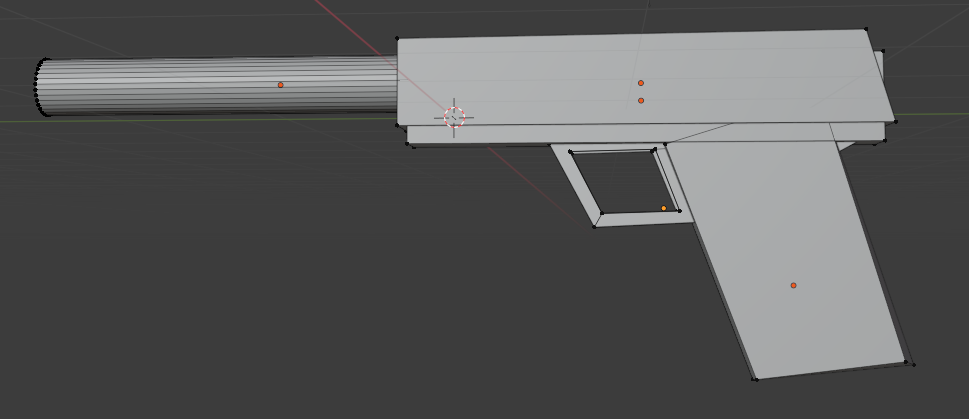

# Create a 3D Model Weapon

Here we create a 3D model of a weapon with a silencer. It seems daunting, but it is fairly easy to do if you have a nice reference.

#### Setup

1. Start a new project (General template).
2. Add a reference photo as background: **Add -> Image -> Reference**.

#### Block out the basic shapes

- Add a **cylinder** (barrel/silencer).
- Add a **cube** and elongate it (**S**, then **X**) to sit next to the cylinder.
- Add another cube as the **handgrip**.
- Add a cube, elongated, under the bullet chamber.
- Add a cube as the **finger grip**.

Tip: press **Ctrl+A -> Scale** after resizing objects so later tools behave properly.

#### Shape the finger grip

1. Switch to the **Modeling** workspace (tab at the top).
2. Select the **Poly Build** tool in the left toolbar.
3. Shape the finger grip. Do the same for the handgrip and any other parts.

#### Cut the finger grip hole

1. Select the finger grip and press **Tab** to enter **Edit Mode**.
2. Press **A** to select all.
3. Turn on **X-ray** (**Alt+Z**) so the cut reaches the hidden side.
4. Press **K** for the Knife. **Click** (don't drag) to place each point around the hole outline, and click the first point again to close the shape.
5. Press **Enter** to confirm the cut.
6. Press **3** for Face select, click inside the outlined area, and press **X -> Faces**.

The hole is now cut. If a thin plane is left behind, repeat steps 4-6 on the opposite side, or select the leftover face and delete it.

#### Finish

That's the basic model. Most of the work is placing and aligning the parts. From here you can refine it with **Bevel** (Ctrl+B), a **Subdivision Surface** modifier, and detail work.
