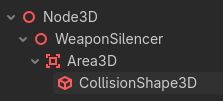
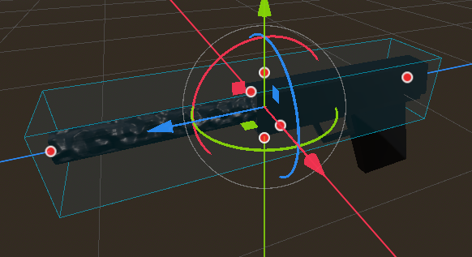

# Add collectibles in Godot

As example, we create a collectible gun prop.

We create a scene, because we can then reuse it across the game, wherever we wish it to be.

- Create new scene, call it: `CollectGun.tscn`
- Add your 3D model of a weapon
- Add a childnode: Area3D -> CollisionShape3D -> Then select BoxShape3D



In `transform` in the right pane, adjust the `Z` scale to: 5.0, so that it covers the entire weapon.

it should look like this:



The blue lines are the CollisionShape3D areas, which we need to let the player run into, and trigger an event that updates our player with having an extra weapon, ammo or health. Depending on what we want.


#### Collectible.gd

Drag this script to the `3DModel` of the Weapon node, in our case `WeaponSilencer`

```
extends Node3D

@onready var area: Area3D = $Area3D

func _ready() -> void:
	area.body_entered.connect(_on_body_entered)

func _on_body_entered(body: Node3D) -> void:
	if body.is_in_group("player"):
		body.collected_weapon = true
		body.collected_type = 'gun'
		body.current_collectible = self
		visible = false
		GameManager.bullets += 30
		EventBus.player_ammo_changed.emit(30, 30)
```

> Note: The above script assumes you have the `EventBus` and `GamwManager` autoloads. They basically signal the HUD to increase ammunition count with 30 bullets.

#### Player script

Add this to your player script logic:

```
# Collectibles
var collected_weapon: bool = false
var collected_type: String = ""
var current_collectible: Node3D = null
```

To later utilize it.
