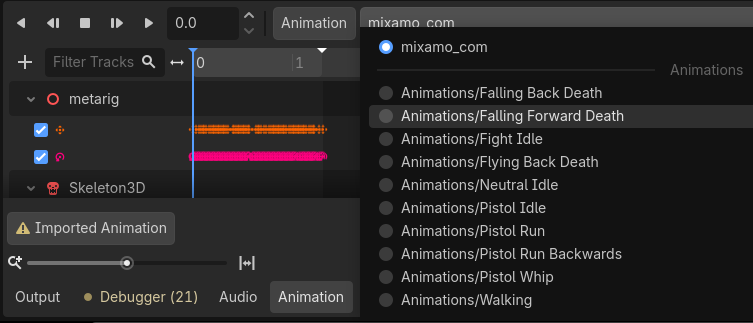

# Mixamo

- Go to Mixamo: https://www.mixamo.com/
- Upload your model
- Select a animation, and download them with default settings.

Do this until you have all animations you want.

We won't use these files. Instead, we have one walking model. And then extract all animations from each downloaded model and consolidate them into one model.

# Consolidate animations from Mixamo

Each Mixamo download is its own file with one animation inside, so the job is to collect them all into the character's one AnimationPlayer, then tell the script which name to play when. Every animation has to come from the same character skeleton, so they must all be downloaded for your rigged character, not a stock Mixamo one.

We assume you aready have a `Enemy.tscn` scene. Look for the main README.md on how to create one first.

### Give each animation file its own saved name (once per file)

Create a `/Res/` folder to store the `.res files.`

Collect the animations:

- Double-click an animation FBX (for example Pistol Run.fbx) to open its import window.
- In the tree on the left, click the animation entry (mixamo_com).
- Actions -> Set animations save path -> Save To File
- Click Reimport
- Then in the saved `/Res/` folder: set the path to something meaningful, like run.res.
- Then repeat for each file: idle, walk, run, death, and so on. Name them idle.res, walk.res, run.res, death.res.

### Put them all into the character's AnimationPlayer



- Open the character model scene (the Walking scene you made, with the AnimationPlayer in it). (You might need to resave if it's a FBX!)
- Select the AnimationPlayer, click Animation in the bottom panel, then Manage Animations.
- Click "New Library", and name it `Animations`.
- On the new Animations row, click the folder icon (Load animation from file) and pick walk.res. Repeat for run.res, idle.res and death.res. Each animation takes the name of its file.
- Once saved, remove the original and replace it with the new `Model.tscn` you just saved.

Now drag the `Model.tscn` into the `Enemy.tcsn`, below `CharacterBody3D`

Then play the game to see if it worked.

Done!

---

### Rigging in Godot (skip if you just used Mixamo)

This is ONLY needed if you didn't use Mixamo! In Godot, we can do a similar thing as in Mixamo, but's it's harder.

### Prepare your skeleton model (once)

- In the FileSystem panel, double-click your model file to open its import window.
- Select Skeleton3D in the tree on the left. On the right, under Retarget, click the empty Bone Map box and choose New BoneMap.
- Click the new BoneMap. Set Profile to SkeletonProfileHumanoid. Godot matches your bones by name. You can click the dots to check.
- Click Reimport. The skeleton node is now called GeneralSkeleton.

### Get an animation from Mixamo

- On mixamo.com, choose a standard character, pick an animation, and download it as FBX Binary with Skin set to Without Skin.
Drag the FBX into your Godot project.
- Double-click it, select Skeleton3D, create a new BoneMap with the SkeletonProfileHumanoid profile, and click Reimport.

### Save the animation as a file

- In the same import window, click Actions… > Set Animation Save Paths, choose a folder, and click Reimport. Godot writes the animation as a .res file (yours is mixamo_com.res).

### Add it to your model's scene

- Right-click your model in the FileSystem and choose New Inherited Scene.
- Select its AnimationPlayer, click Animation > Manage Animations, choose New Library and name it, then click the folder icon on that library's row and pick the .res file.
- Close the window, select the animation in the dropdown, and press play.

### If the skeleton doesn't move

- Select GeneralSkeleton in the Scene tree. In the Inspector, make sure Show Rest Only is off.
- Expand Bones > Hips > Pose in the Inspector and scrub the timeline.
- Do the numbers change? If they do but the mesh doesn't move, the mesh isn't following the skeleton. If they don't change, the animation isn't reaching the bones.
- Select the AnimationPlayer and check that Root Node is ...

### In the actual game

- Play the animation from a script with:

```$AnimationPlayer.play("Mixamo/mixamo_com")```

using your library name and the animation name.
